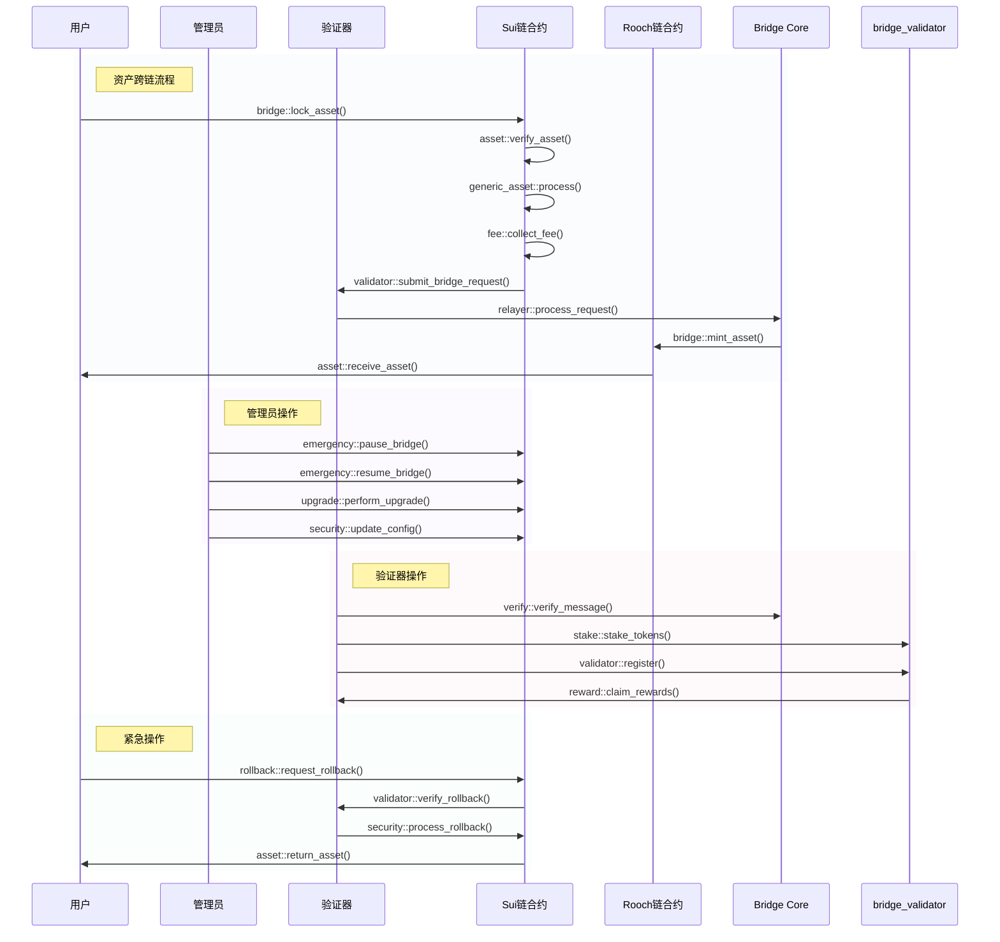

# move-bridge(WIP)
A protocol for transferring assets across chains between move-vms without permission

## 项目简介
move-bridge 是一个跨链桥项目，用于在不同的Move虚拟机之间进行资产转移。项目包含多个核心组件，每个组件都有其特定的功能和职责。

## 角色交互说明

系统中包含以下主要角色：
1. **用户**: 发起跨链转账的普通用户，可以进行资产跨链和紧急回滚操作
2. **验证者**: 负责验证跨链消息、维护网络安全的节点运营商，参与质押和奖励分配
3. **中继器**: Bridge Core中的核心组件，负责跨链消息的处理和传递
4. **管理员**: 负责系统参数配置、紧急操作和升级的治理角色

### 详细交互流程

### 核心流程详解

1. **资产跨链流程**
   - **锁定阶段**
     * `bridge::lock_asset()`: 用户发起资产锁定请求
     * `asset::verify_asset()`: 验证资产合法性和可用性
     * `generic_asset::process()`: 处理通用资产格式转换
     * `fee::collect_fee()`: 收取跨链手续费
   
   - **验证阶段**
     * `validator::submit_bridge_request()`: 提交跨链请求给验证器
     * `relayer::process_request()`: Bridge Core处理跨链请求
   
   - **发放阶段**
     * `bridge::mint_asset()`: 目标链铸造对应资产
     * `asset::receive_asset()`: 用户接收跨链资产

2. **管理员操作流程**
   - **紧急控制**
     * `emergency::pause_bridge()`: 暂停桥接操作
     * `emergency::resume_bridge()`: 恢复桥接操作
   
   - **系统维护**
     * `upgrade::perform_upgrade()`: 执行合约升级
     * `security::update_config()`: 更新安全配置

3. **验证器操作流程**
   - **验证操作**
     * `verify::verify_message()`: 验证跨链消息
     * `stake::stake_tokens()`: 质押代币
     * `validator::register()`: 注册成为验证器
     * `reward::claim_rewards()`: 领取验证奖励

4. **紧急操作流程**
   - **回滚操作**
     * `rollback::request_rollback()`: 用户请求回滚
     * `validator::verify_rollback()`: 验证回滚请求
     * `security::process_rollback()`: 处理回滚操作
     * `asset::return_asset()`: 返还用户资产

### 模块间交互说明

1. **Bridge Core 与链上合约**
   - 标准化消息格式
   - 验证消息签名
   - 处理跨链请求
   - 维护消息队列

2. **验证器与链上合约**
   - 提交验证结果
   - 处理质押操作
   - 参与共识投票
   - 处理奖励分配

3. **管理员与系统**
   - 系统参数配置
   - 紧急操作处理
   - 升级流程管理
   - 验证器管理

4. **用户与系统**
   - 发起跨链请求
   - 接收跨链资产
   - 请求紧急回滚
   - 查询交易状态

### 安全保障机制

1. **多重验证机制**
   - 验证器多签名确认
   - 跨链消息防重放
   - 资产锁定证明
   - 交易状态验证

2. **权益证明机制**
   - 验证器质押要求
   - 作恶惩罚机制
   - 退出冷却期限
   - 奖励分配机制

3. **紧急处理机制**
   - 系统暂停功能
   - 交易回滚能力
   - 紧急升级流程
   - 资产安全保护

4. **治理机制**
   - 参数调整投票
   - 验证器准入控制
   - 费用调整机制
   - 升级提案流程

## 项目结构

项目包含以下主要组件：

### bridge-core

核心库包，提供跨链桥的基础功能：
- `relayer`: 中继器实现，负责消息的跨链传递
- `types`: 核心数据类型定义
- `verify`: 验证相关的功能实现

### sui-bridge

Sui链上的桥接合约实现：
- `bridge.move`: 主要的桥接逻辑实现
- `control.move`: 桥接控制和治理功能
- `asset_manager.move`: 资产管理，包括锁定和解锁功能
- `validator.move`: 验证者相关功能
- `upgrade.move`: 合约升级相关功能

### rooch-bridge

Rooch链上的桥接合约实现：
- `bridge.move`: Rooch链上的桥接核心逻辑
- `control.move`: Rooch链上的控制和治理功能
- `asset_manager.move`: Rooch链上的资产管理
- `validator.move`: Rooch链上的验证者功能

### bridge_validator

验证者节点实现，负责：
- 验证跨链消息
- 参与共识过程
- 确保跨链资产安全

## 主要功能

1. **跨链资产转移**
   - 支持在不同Move虚拟机之间安全转移资产
   - 实现资产的锁定和解锁机制

2. **验证者机制**
   - 多验证者共同维护跨链安全
   - 实现验证者的准入和退出机制

3. **资产管理**
   - 支持多种资产类型
   - 实现资产的安全托管

4. **治理功能**
   - 支持参数配置和更新
   - 提供合约升级机制

5. **中继服务**
   - 提供可靠的跨链消息传递
   - 确保消息的有序性和可靠性